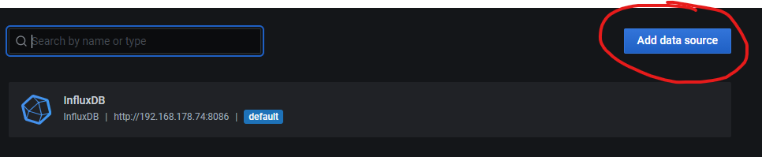
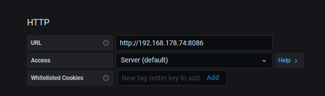
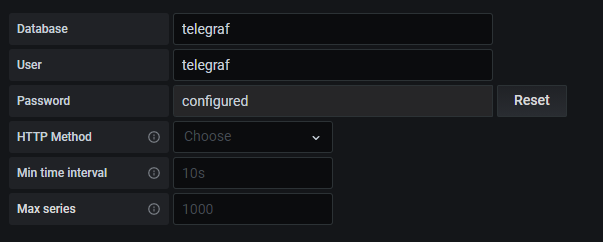
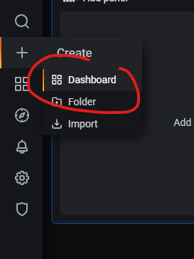
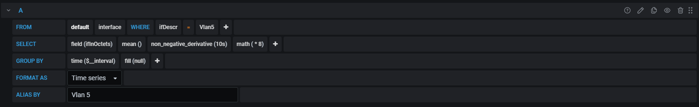

# Monitoring
Simple Cisco Network Monitoring with Grafana, InfluxDB 1.8.3 and Telegraf

# Images

```
grafana/grafana:latest
influxdb:1.8.3
telegraf:latest
```
# Containers

The following containers will be started:

```
CONTAINER ID        IMAGE                    COMMAND                  CREATED             STATUS              PORTS                                                NAMES
fad81e32e817        telegraf:latest          "/entrypoint.sh tele…"   About an hour ago   Up 47 minutes       8092/udp, 0.0.0.0:161->161/udp, 8125/udp, 8094/tcp   telegraf
426a370d6e3e        grafana/grafana:latest   "/run.sh"                About an hour ago   Up 47 minutes       0.0.0.0:3000->3000/tcp                               grafana
5be7720bebeb        influxdb:1.8.3           "/entrypoint.sh infl…"   About an hour ago   Up 47 minutes       0.0.0.0:8086->8086/tcp                               influxdb
```

# Volumes

The following volumes will be created:

```
DRIVER              VOLUME NAME
local               grafana_volume
local               influxdb_volume
local               mib_volume
local               telegraf_volume
```

# Networks

The following networks will be created:

```
NETWORK ID          NAME                 DRIVER              SCOPE
a7a4cd4a38fe        monitoring_default   bridge              local
```

# MIBs

MIBs can be added via the mib_volume.

# InfluxDB 1.8.3

The InfluxDB needs to be manually created after starting the container for the first time.

```
➜  monitoring docker exec -it influxdb bash
root@5be7720bebeb:/# influx
Connected to http://localhost:8086 version 1.8.3
InfluxDB shell version: 1.8.3
> create database test
> create user test with password 'test'
> show users
user     admin
----     -----
telegraf false
test     false
> grant ALL on test to test
> show GRANTS for test
database privilege
-------- ---------
test     ALL PRIVILEGES
> quit
```

Restart container after that.

```
➜  monitoring docker restart influxdb 
influxdb
```

# Telegraf

The `telegraf.conf` file can be edited via the `telegraf_volume`. All configuration files will be stored in this volume.

## Outputs

File: `telegraf.conf`
```
[[outputs.influxdb]]
urls = ["http://1.2.3.4:8086"]
database = "telegraf"
username = "telegraf"
password = "password"
```


## Inputs

File: `telegraf.conf`
```
[[inputs.snmp]]
agents = ["udp://1.2.3.4:161"]
version = 2
community = "home"

[[inputs.snmp.field]]
name = "hostname"
oid = "RFC1213-MIB::sysName.0"
is_tag = true

[[inputs.snmp.field]]
name = "uptime"
oid = "DISMAN-EXPRESSION-MIB::sysUpTimeInstance"

[[inputs.snmp.table]]
name = "interface"
inherit_tags = [ "hostname" ]
oid = "IF-MIB::ifTable"

[[inputs.snmp.table.field]]
name = "ifDescr"
oid = "IF-MIB::ifDescr"
is_tag = true

[[inputs.snmp.table]]
name = "interface"
inherit_tags = [ "hostname" ]
oid = "IF-MIB::ifXTable"

[[inputs.snmp.table.field]]
name = "ifDescr"
oid = "IF-MIB::ifDescr"
is_tag = true

[[inputs.snmp.table]]
name = "interface"
inherit_tags = [ "hostname" ]
oid = "EtherLike-MIB::dot3StatsTable"

[[inputs.snmp.table.field]]
name = "ifDescr"
oid = "IF-MIB::ifDescr"
is_tag = true
```

## Delete snmp.conf

```
cd /etc/snmp
rm -rf snmp.conf
```

## Test SNMP connection

Make sure there are no ACLs in place that could block you from accessing the device with SNMP. For security use SNMPv3.

```
root@fad81e32e817:~# snmpwalk -v2c -c home 192.168.178.200 sysUpTime.0
Did not find 'zeroDotZero' in module SNMPv2-SMI (/usr/share/snmp/mibs/EVENT-MIB.my)
MIB search path: /root/.snmp/mibs:/usr/share/snmp/mibs:/usr/share/snmp/mibs/iana:/usr/share/snmp/mibs/ietf:/usr/share/mibs/site:/usr/share/snmp/mibs:/usr/share/mibs/iana:/usr/share/mibs/ietf:/usr/share/mibs/netsnmp
Cannot find module (DISMAN-SCHEDULE-MIB): At line 10 in (none)
Cannot find module (MTA-MIB): At line 10 in (none)
Cannot find module (NETWORK-SERVICES-MIB): At line 10 in (none)
Cannot find module (IPV6-ICMP-MIB): At line 10 in (none)
Cannot find module (IPV6-TCP-MIB): At line 10 in (none)
Cannot find module (IPV6-UDP-MIB): At line 10 in (none)
Cannot find module (SNMPv2-TM): At line 10 in (none)
DISMAN-EVENT-MIB::sysUpTimeInstance = Timeticks: (517546704) 59 days, 21:37:47.04
```

# Add data source in grafana








# Create Dashboard

create-dashboard.png



Create a graph and enter the following information for interface throughput stats.

